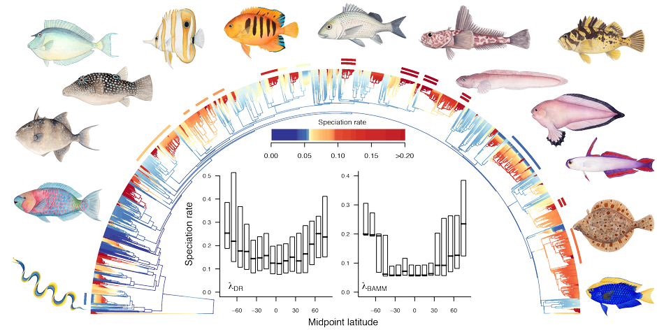
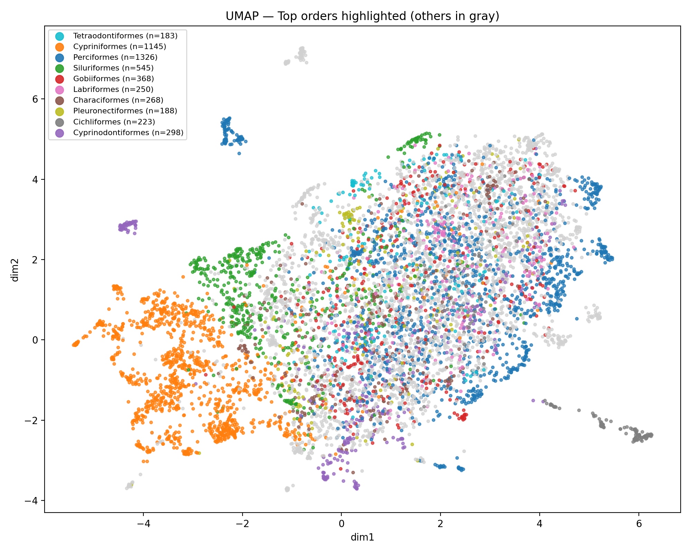
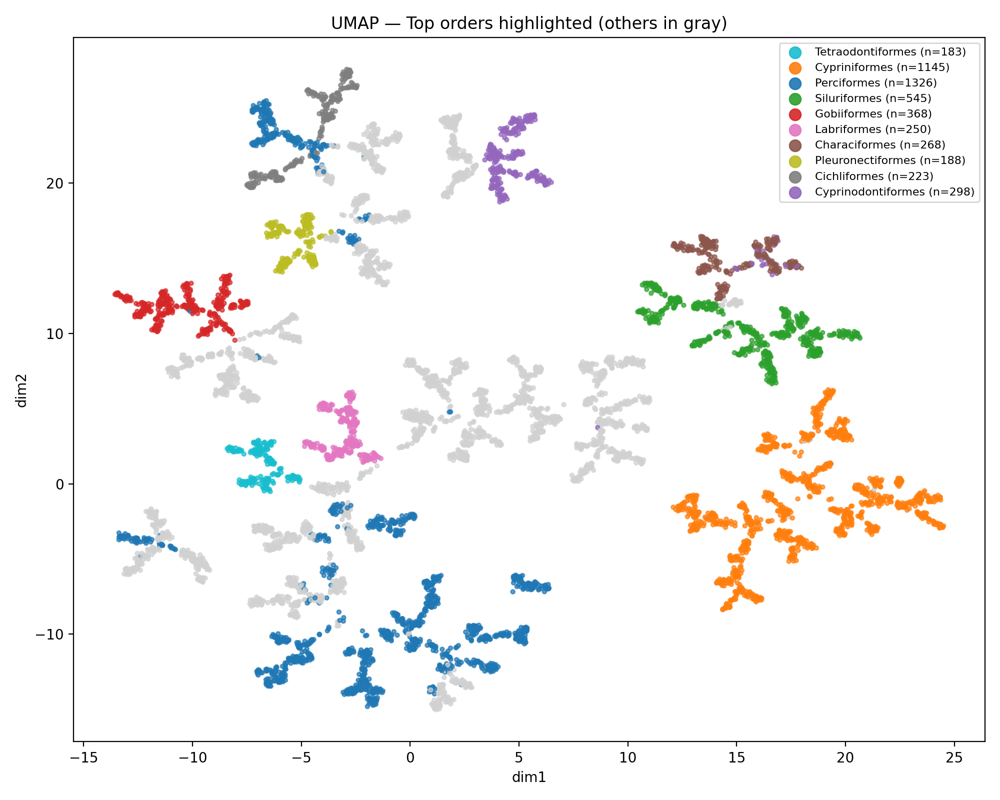
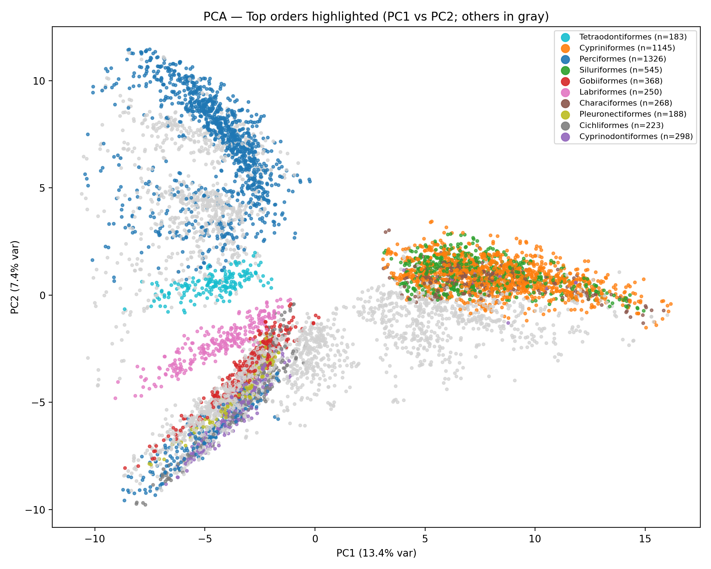
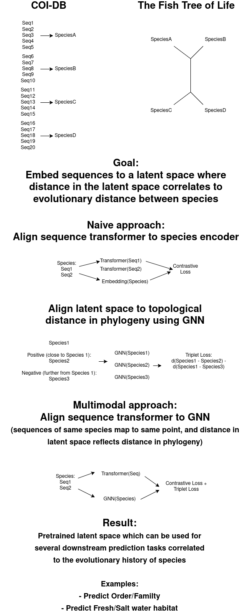

# Multimodal Representation Learning for Biodiversity using DNA and Phylogeny

(Proof of concept implementation, mostly AI written at this point)

## Project Overview

Biodiversity monitoring increasingly relies on **environmental DNA (eDNA)**: short DNA sequences collected from water, soil, or air that indicate which species are present in an ecosystem. While modern sequencing pipelines can identify species, they do **not naturally produce meaningful continuous embeddings** that reflect evolutionary relationships or ecological similarity.

This project explores whether we can learn **biologically meaningful latent representations** by combining:

- **DNA sequences** (COI barcodes)  
- **Phylogenetic structure** (Tree of Life relationships between species)

using **multimodal representation learning**.

Our core question is:

> *Can we learn a latent space where unseen DNA sequences are embedded in a way that reflects evolutionary relationships between species?*

---

## Why this matters

- Species are **not independent categories** — they are related by evolution.
- Current ML models often treat species labels as flat, unrelated classes.
- A phylogeny encodes *millions of years of biological structure* that is currently ignored by most DNA classifiers.
- A good embedding space enables:
  - Generalization to unseen species
  - Better ecological similarity measures
  - Downstream prediction tasks (habitat, traits, community structure)

---

## Data

### DNA modality
- [COI fish barcode sequences](https://mare-mage.weebly.com/coi_db-all-sequences.html) (∼650 bp)
- Many sequences per species
- Sequences are **unaligned** and treated as raw strings

### Phylogeny modality
- [A large fish phylogeny](https://fishtreeoflife.org/) (Tree of Life)
- Species appear as **leaf nodes**
- Tree converted to a graph:
  - Nodes = internal + leaf nodes
  - Edges = parent–child relations
  - Hop distance ≈ evolutionary distance (topology-based)

---

## Stage 1: Unimodal Baselines

We first learn representations from **each modality independently**, to understand what structure they capture.

---

## Baseline 1: DNA-only Model (Sequence Transformer)

### Model
- Transformer encoder over raw DNA sequences
- Each sequence maps to a latent vector `z_seq ∈ ℝ^D`
- A **learned species embedding table** acts as targets

### Training objective (CLIP-style contrastive learning)

For each sequence:
- Pull embedding toward its species embedding
- Push away embeddings of other species in the batch

This uses an **InfoNCE / CLIP loss**, adapted for DNA.

### Training process

For each training batch:
1. Pick B species
2. Pick K sequences per species
3. Encode each sequence with a Transformer → z_seq
4. Look up that sequence’s species “anchor” embedding → z_sp
5. Use contrastive (CLIP) loss so each z_seq[i] matches its own z_sp[i] and not others

### What we observe

We visualize the learned species embeddings after training to observe the cosine distance between species in the biggest orders.

#### UMAP visualization

Even though the loss only enforces **species-level separation**, the learned latent space shows:

- Clustering by **order** and **family**
- Smooth transitions between related taxa

This emerges implicitly because:
- Related species share DNA motifs
- Many sequences per species act as a regularizer

But this separation is not perfect for most orders, indicating that learned embeddings from just unaligned COI sequence does not capture complete evolutionary relationships. 

## Baseline 2: Phylogeny-only Model (Graph Neural Network)

### Model
- Graph Neural Network (GCN)
- Operates directly on the phylogenetic tree graph
- Learns embeddings for **all nodes**, especially leaf nodes (species)

### Training objective (metric learning on the tree)

We use a **triplet loss**:
- Anchor = random leaf
- Positive = leaf within `k` hops
- Negative = leaf further away in the tree

This enforces:
- Nearby species in the tree → nearby in embedding space
- Distant species → far apart

### Training process

You want triplets 
(i,j,k)
(i,j,k) where:

* i: anchor leaf
* j: “near” leaf (close on tree)
* k: “far” leaf (farther on tree)

And then apply a triplet loss on cosine distance:

`max(0, m + d_cos(z_i, z_j) - d_cos(z_i, z_k))`

### What we observe

#### UMAP visualization

#### PCA visualization

- Strong clustering by taxonomic rank
- Clear separation between distant orders

---

## Quantitative Evaluation (Unimodal)

We evaluate embeddings using cosine distance:

1. **kNN order purity**
   - Fraction of nearest neighbors belonging to the same order
2. **kNN intra-order distance**
   - Local compactness of each order
3. **Inter-order separation**
   - Distance between order centroids normalized by dispersion

These metrics confirm:
- DNA-only embeddings capture *some* hierarchy
- Phylogeny-only embeddings capture it much more explicitly

---

## Stage 2: Multimodal Learning (DNA + Phylogeny)

The key idea is to **combine both modalities** so that:

> DNA sequences are embedded directly into a phylogeny-structured space.

---

## Multimodal Strategy

We treat:
- **DNA model** as one encoder
- **Phylogeny GNN** as another encoder

and align their outputs.

### High-level schematic
        DNA sequence                    Phylogeny
             │                             │
             ▼                             ▼
    Transformer encoder              GNN encoder
             │                             │
             ▼                             ▼
       z_seq (DNA)                  z_phy (species)
             │                             │
             └───── alignment loss ────────┘
                        (contrastive)

## Quick drawing I used to explain to Sara
